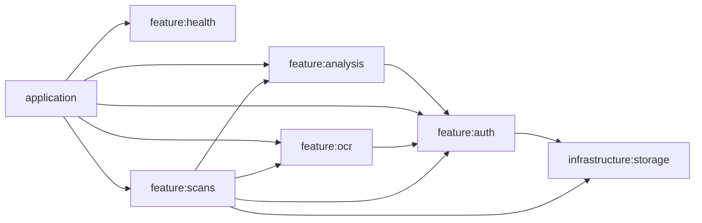

# Backend dependency graph

Generated from `backend/module-map.json`. Do not edit by hand.

```mermaid
flowchart LR
  application["application"]
  feature_analysis["feature:analysis"]
  feature_auth["feature:auth"]
  feature_health["feature:health"]
  feature_ocr["feature:ocr"]
  feature_scans["feature:scans"]
  infrastructure_storage["infrastructure:storage"]
  application --> feature_analysis
  feature_analysis --> feature_auth
  application --> feature_auth
  feature_auth --> infrastructure_storage
  application --> feature_health
  application --> feature_ocr
  feature_ocr --> feature_auth
  application --> feature_scans
  feature_scans --> feature_analysis
  feature_scans --> feature_auth
  feature_scans --> feature_ocr
  feature_scans --> infrastructure_storage
```
